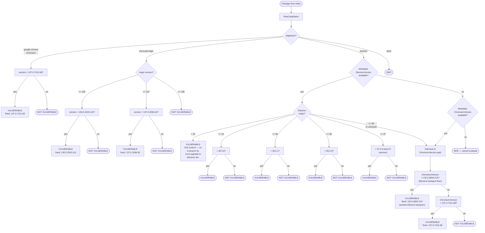

# CVE-2025-5419 Detector

Detects installations of Chromium-based applications affected by
[CVE-2025-5419](https://nvd.nist.gov/vuln/detail/CVE-2025-5419) — an
out-of-bounds read and write in V8 that allows a remote attacker to
exploit heap corruption via a crafted HTML page.

- **CVSS 3.1**: 8.8 HIGH (`AV:N/AC:L/PR:N/UI:R/S:U/C:H/I:H/A:H`)
- **CISA KEV**: added 2025-06-05, remediation deadline 2025-06-26

## Fixed Versions

| Product | Fixed version | Notes |
|---|---|---|
| Google Chrome / Chromium | **137.0.7151.68** | Stable channel |
| Microsoft Edge | **137.0.3296.62** | Stable channel |
| Microsoft Edge | **136.0.3240.115** | Extended Stable channel |
| Electron 34.x | **34.5.8** | Backport; embeds Chromium 132.0.6834.210 |
| Electron 35.x | **35.5.1** | Backport; embeds Chromium 134.0.6998.205 |
| Electron 36.x | **36.4.0** | Backport; embeds Chromium 136.0.7103.149 |
| Electron 37.x | **37.0.0-beta.3** | Backport; embeds Chromium 138.0.7190.0 |
| Electron < 34 | — | EOL; no in-branch fix available |

## Required Extractor

This detector depends on the `misc/chromiumapps` extractor, which must
run first to populate the package index with Chromium-family packages.

## Detection Decision Tree

The detector evaluates each package through the following logic:

### Key design notes

**Standalone Chrome vs Electron-embedded Chromium**

Standalone Chrome and Chromium packages are always evaluated directly
against `137.0.7151.68`. The Electron backport floor (`132.0.6834.210`)
only applies to Electron's *embedded* Chromium core: Electron 34.5.8
shipped a patched Chromium 132, but no equivalent patch was released for
the standalone Chrome 132 channel.

**Electron version comparison**

Electron versions are compared using semver semantics via
`golang.org/x/mod/semver`. Four-part numeric versions such as `36.4.0.1`
have their fourth segment stripped before comparison (`36.4.0`), so they
are treated as equal to — rather than greater than — the three-part
release. Pre-release tags (e.g. `37.0.0-beta.3`) are handled correctly:
any stable release is considered newer than a beta of the same version.

**EOL Electron branches (major < 34)**

Electron branches below major 34 received no backport fix. These
installations are flagged as vulnerable. The finding's `extra` field
explicitly notes that no in-branch fix exists and users must upgrade to
Electron 34 or later.
